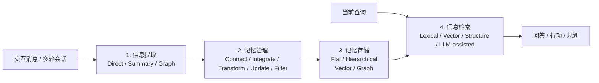

# Agent Memory 方案总结：10 种代表性 LLM 智能体记忆方法的统一拆解

基于论文 [Memory in the LLM Era: Modular Architectures and Strategies in a Unified Framework](https://arxiv.org/pdf/2604.01707) 与文中统一复现结果整理，面向个人学习使用。  
写法参考内部“产品实现逻辑解剖”风格：先看问题定位，再按系统层拆解，最后收束到关键取舍与结论。  
更新时间：2026-06-28

---

## 一、问题定位：Agent Memory 不是“外挂向量库”，而是长期上下文操作系统

传统 RAG 解决的是“外部知识怎么查回来”，而 Agent Memory 解决的是另一类问题：**交互过程中哪些信息该记、如何更新、存在哪一层、什么时候再取回来。**

所以，长期记忆系统的真正分水岭不在于“有没有 memory”，而在于它是否完整覆盖了下面四个环节：

1. **信息提取**：从交互消息里挑出值得进入记忆的内容。
2. **记忆管理**：把新信息和旧记忆做连接、整合、迁移、更新、过滤。
3. **记忆存储**：决定记忆是平铺存、分层存，还是树/图式存。
4. **信息检索**：当新问题到来时，决定用什么方式把相关记忆召回。

如果只做“写入向量库 + 相似度检索”，本质上只覆盖了第四步的一部分，离一个真正可持续的 Agent Memory 系统还差得很远。

---

## 二、统一分析框架：四大核心组件

这套统一框架的价值在于：它把“记忆方法”从一个模糊名词拆成了可比较的工程模块。后面看 10 种方法时，不再只问“谁分数高”，而是问：

- 它提取的是原始对话、摘要，还是实体关系图？
- 它有没有显式的关联、整合、迁移和过滤机制？
- 它的存储是单池、三层，还是树/图？
- 它检索时靠向量、图遍历，还是让 LLM 参与推理？

---

## 三、十种方法的系统地图

下面这张表先给一个总览。为了方便比较，我用的是“主导范式”写法；像 `MemTree`、`MemoryOS`、`MemOS` 这类方法其实都带有一定 hybrid 特征。

| 方法 | 信息提取 | 记忆管理主轴 | 记忆存储 | 信息检索 | 一句话理解 |
| --- | --- | --- | --- | --- | --- |
| `A-MEM` | 直接归档 + 摘要式 | 关联链接 + LLM 更新 | 平层向量存储 | 向量检索 | 把相关记忆显式“连起来” |
| `MemoryBank` | 直接归档 | 每日摘要整合 + 遗忘曲线 + 使用过滤 | 平层单池 | 相似度检索 | 像带时间强度分数的日记本 |
| `MemGPT` | 直接归档 | 层间迁移 + agent 自主更新 | 分层向量存储 | 词汇 + 向量 | 把记忆管理类比成 OS 分页 |
| `Mem0` | 直接归档 + 摘要式 | 相似记忆同步更新 + 内容去重 | 平层向量池 | 向量检索 | 信息保留相对完整，更新联动强 |
| `Mem0g` | 图式 | 结构边 + LLM 更新 + 内容过滤 | 图 + 向量 | 结构检索 | 把记忆显式化为实体关系图 |
| `MemoChat` | 直接归档 | 主题抽象整合 | 轻量平层摘要池 | LLM 辅助检索 | 省 token，但跨会话推理偏弱 |
| `Zep` | 直接归档 + 图式 | 结构边 + 社区形成 + LLM 冲突处理 | 分层图存储 | 词汇 + 向量 + 结构 | 强调关系结构和多跳检索 |
| `MemTree` | 直接归档 | 树内整合 + LLM Aggregate | 树状存储 | 向量检索 | 上层概念摘要、下层原始细节 |
| `MemoryOS` | 直接归档 | 关联 + 抽象/摘要 + 层级迁移 + 规则过滤 | 短/中/长三层向量存储 | 词汇 + 向量 | 性能、成本、稳定性的平衡型方法 |
| `MemOS` | 直接归档 + 摘要式 | 结构边 + 抽象整合 + agent 自主更新 | 树状分层 | 词汇 + 向量 | 强性能，但 token 成本高 |

### 3.1 我会把这 10 种方法分成四个流派看

1. **原始消息保留派**：`MemoryBank`、`MemGPT`  
   优点是信息完整，缺点是如果没有额外关联和整合，后期容易变成噪声堆积。

2. **摘要压缩派**：`A-MEM`、`Mem0`、`MemoChat`  
   优点是成本低、记忆更干净，缺点是摘要写坏了就会把错误长期固化。

3. **图结构派**：`Mem0g`、`Zep`  
   优点是多跳关系天然清晰，缺点是结构化提取容易损失原始语义细节。

4. **树/分层派**：`MemTree`、`MemoryOS`、`MemOS`  
   优点是能兼顾抽象概念和细粒度证据，也是论文里总体表现最强的一类。

---

## 四、信息提取层：先决定“写进去什么”

信息提取本质上是在做一个早期筛选器。筛选得太弱，后面都是噪声；筛选得太狠，后面会缺证据。

| 提取方式 | 具体做法 | 优点 | 风险 | 代表方法 |
| --- | --- | --- | --- | --- |
| **直接归档** | 原始消息 + 时间戳直接入库 | 信息最完整，不丢上下文 | 冗余大，后续检索噪声高 | `MemoryBank`、`MemGPT` |
| **摘要式提取** | 用 LLM 生成摘要、关键词、标签 | 压缩有效，便于长期维护 | 摘要会丢细节，也可能引入抽象偏差 | `A-MEM`、`Mem0`、`MemOS` |
| **图式提取** | 抽取实体、关系、时间，形成三元组/图 | 关系清晰，利于多跳 | 语义细腻度下降，容易丢原文语境 | `Mem0g`、`Zep` |

工程上很多方法其实不是单一范式，而是 **hybrid extraction**：

- `A-MEM`、`Mem0`、`MemOS` 同时保留了直接归档和摘要提取。
- `Zep` 同时保留了原始消息与图式抽取。
- `MemTree`、`MemoryOS` 的“摘要化”更多发生在后续管理阶段，而不是第一步提取阶段。

### 4.1 这一层的核心分歧

**分歧不在于“要不要压缩”，而在于“压缩后还能不能找回原始语义”。**

- `MemoryBank` 和 `MemGPT` 的优势，是**原始消息还在**，后面如果检索和拼接做得好，回答时仍能回到原证据。
- `A-MEM` 和 `Mem0` 的优势，是在保留直接归档底座的同时，把信息额外变成更高密度的记忆单元，降低长期维护成本。
- `Mem0g` 和 `Zep` 的问题，则是把语言压成图之后，结构更清楚，但**说话语气、限定条件、事件细节**这些东西更容易丢。

### 4.2 论文给出的关键判断

论文的一个很重要结论是：**信息完整性非常关键。**  
只保留图三元组的方法，往往不如还能保留原始对话片段的方法。一个直接例子是：在论文复现里，`Mem0` 在很多设置下都优于 `Mem0g`，作者明确把这解释为图式抽取带来的信息损失。来源见论文对 LOCOMO 结果的讨论：[arXiv PDF](https://arxiv.org/pdf/2604.01707)。

---

## 五、记忆管理层：真正决定方法差异的地方

如果说信息提取是在决定“写什么”，那记忆管理就是在决定“这些记忆以后会变成什么样”。论文把它拆成 5 个操作。

| 操作 | 要解决的问题 | 典型实现 | 代表方法 | 主要价值 |
| --- | --- | --- | --- | --- |
| **关联相关经验** | 让分散记忆彼此可达 | 关联链接 / 图结构边 | `A-MEM`、`Zep`、`Mem0g`、`MemoryOS` | 提升多跳推理能力 |
| **整合碎片化记忆** | 减少重复，形成更高层抽象 | 摘要 / 抽象 / 聚合 | `MemoryBank`、`MemoChat`、`MemTree` | 控制冗余，形成主题视图 |
| **跨层级转换** | 让短期信息进入长期结构 | FIFO 转移 / 社区形成 / 热度晋升 | `MemGPT`、`MemoryOS`、`Zep` | 解决上下文窗口装不下的问题 |
| **更新现有记忆** | 把新证据并入旧记忆 | 规则驱动 / LLM 驱动 / agent 驱动 | `MemoryBank`、`MemTree`、`MemGPT`、`MemOS` | 保持记忆新鲜、减少冲突 |
| **过滤无效信息** | 清掉过时、重复、低价值项 | 时间衰减 / 访问频率 / 相似度去重 | `MemoryBank`、`MemoryOS`、`Mem0` | 降低噪声，提高检索精度 |

### 5.1 三种更新范式

#### 1. 规则驱动

代表方法是 `MemoryBank` 和 `MemoryOS`。

- `MemoryBank` 用艾宾浩斯遗忘曲线给记忆强度打分。
- `MemoryOS` 用更系统的层级迁移、热度/频率等规则做管理。

优点是稳定、可控、好调试。缺点是规则边界比较硬，不够灵活。

#### 2. LLM 驱动

代表方法是 `MemTree`、`Zep`、`Mem0g`。

- `MemTree` 让 LLM 执行树内 Aggregate Operation。
- `Zep` 用 LLM 做图内冲突处理和语义约束更新。

优点是压缩能力强，表达力高。缺点是每次更新都可能引入新的抽象误差。

#### 3. Agent 驱动

代表方法是 `MemGPT`、`Mem0`、`MemOS`。

- 它们不只是在“合并两条文本”，而是让 agent 自己决定是 revise、merge、prune 还是 recall。

优点是自治性高，更像真实系统。缺点是 token 成本高，而且行为更难预测。

### 5.2 这一层最重要的经验

论文里最值得记住的一句其实是：**记忆关联能力，是多跳推理的核心。**

- 没有显式或隐式“连接”操作的方法，如 `MemoryBank`、`MemGPT`、`MemoChat`，在 LONGMEMEVAL 的多会话任务和 LOCOMO 的多跳任务上表现都偏弱。
- `Mem0` 虽然没有把“连接”做成显式图结构，但它会在写入时同步更新相似记忆，因此形成了一种**隐式关联**。这也是它显著强于 `MemoryBank` 的重要原因。

论文直接给出的一个量化观察是：在 LONGMEMEVAL 的 Multi-Session 任务上，`Mem0` 相比 `MemoryBank` 有明显提升。来源仍是统一框架论文的实验分析：[arXiv PDF](https://arxiv.org/pdf/2604.01707)。

---

## 六、记忆存储层：决定“记忆长什么样”

存储层可以从两个维度看：**组织方式** 和 **表示方式**。

### 6.1 组织方式：平层 vs 分层

| 组织方式 | 含义 | 代表方法 | 优点 | 风险 |
| --- | --- | --- | --- | --- |
| **平层存储** | 所有记忆在一个统一池里 | `MemoryBank`、`Mem0` | 实现简单、读写直接 | 规模大后噪声和冲突明显 |
| **分层存储** | 不同层承载不同粒度/职责 | `MemGPT`、`MemoryOS`、`MemOS`、`MemTree` | 便于长期维护和信息迁移 | 系统复杂度更高 |

### 6.2 表示方式：向量 vs 图

| 表示方式 | 含义 | 代表方法 | 优点 | 风险 |
| --- | --- | --- | --- | --- |
| **向量存储** | 文本嵌入后按语义相似度检索 | 绝大多数方法 | 通用、成熟、实现成本低 | 结构关系不显式 |
| **图存储** | 用树、知识图、时间图表示关系 | `MemTree`、`Zep`、`Mem0g`、`MemOS` | 多跳关系清晰，层次性强 | 维护和更新成本更高 |

### 6.3 为什么树/分层方法整体更强

这是论文最明确的总体结论之一：

- `MemTree`、`MemOS` 这类**树状结构**方法，在上层保留概念摘要、在叶子保留细节，因此能同时兼顾抽象和回溯。
- `MemoryOS` 这类**分层结构**方法，可以把短期、中期、长期记忆的管理策略拆开，避免所有信息都挤在一个池子里竞争。

换句话说，树/分层方法强，不是因为“结构更高级”，而是因为它们更像一个真正的缓存体系：

1. 高频、最近的信息留在近处。
2. 稳定、长期的信息上升到更抽象的层。
3. 需要追证据时，还能回到更细的节点或叶子。

---

## 七、信息检索层：最后决定“能不能把记忆叫回来”

| 检索范式 | 做法 | 适合场景 | 局限 | 代表方法 |
| --- | --- | --- | --- | --- |
| **词汇检索** | BM25、Jaccard 等表层匹配 | 专有名词、短语、实体精确命中 | 同义改写和语义失配明显 | 常作基础补充 |
| **向量检索** | 嵌入后做 top-k 相似度搜索 | 通用语义召回 | 结构关系不显式 | 大多数方法 |
| **结构检索** | 图遍历、树搜索、子图扩展 | 多跳推理、关系型问题 | 维护成本更高 | `Mem0g`、`Zep`、`MemTree`、`MemOS` |
| **LLM 辅助检索** | 让 LLM 改写 query、抽实体、引导搜索 | 模糊查询、复杂任务 | 成本更高，也更依赖模型质量 | `MemoChat`、`MemGPT` 等 |

### 7.1 这一层最容易被忽略的事实

很多方法看起来是在拼“检索器质量”，但论文的结果说明：**如果前面的信息提取和记忆管理做坏了，检索再强也只能在坏记忆里找答案。**

因此，信息检索更像是最后一道放大器：

- 好的记忆组织会让检索变简单。
- 差的记忆组织会把检索变成高成本补救。

这也是为什么 `MemoryOS` 在成本-性能权衡上表现更好：它不是单纯靠更多 tokens 强行搜，而是前面几层已经把信息分好类了。

---

## 八、评估基准：论文主要用什么测这些方法

### 8.1 LOCOMO

`LOCOMO` 面向**人类-人类长程对话**。

- 共 `10` 个长对话。
- 每个对话平均 `198.6` 个问题。
- 平均跨 `27.2` 个 session。
- 平均约 `588.2` 个对话轮次。
- 评估四种能力：`Single-Hop Retrieval`、`Multi-Hop Retrieval`、`Temporal Reasoning`、`Open-Domain Knowledge`。

### 8.2 LONGMEMEVAL

`LONGMEMEVAL` 面向**用户-AI 长期交互**。

- 共 `500` 个高质量问题。
- 每个样本平均 `50.2` 个 session。
- 平均历史长度约 `115,000` tokens。
- 评估四种长期记忆能力：`Information Extraction`、`Multi-Session Reasoning`、`Knowledge Updates`、`Temporal Reasoning`。

### 8.3 这些 benchmark 在奖励什么

| Benchmark | 更偏重什么 | 对方法的压力点 |
| --- | --- | --- |
| `LOCOMO` | 多跳、时间线、跨 session 证据拼接 | 关联能力和结构检索 |
| `LONGMEMEVAL` | 信息提取、知识更新、长期一致性 | 更新机制和上下文持久化 |

---

## 九、论文实验给出的关键结论

### 9.1 树状/分层存储总体占优

这是最核心的总论。

- 在 `LONGMEMEVAL` 上，`MemTree` 在 7B 设置下拿到 `36.92` 的 overall F1；72B 下最强现有方法是 `MemoryOS`，overall F1 为 `46.04`。
- 在 `LOCOMO` 上，`MemOS` 在 7B 和 72B 设置下分别拿到 `37.05` 和 `42.79` 的 overall F1。
- `MemoryOS` 虽然不是最极致的树结构，但在多个实验里体现出很强的综合平衡能力。

一个方便记忆的最小结果表：

| Benchmark | 7B 最强现有方法 | 72B 最强现有方法 |
| --- | --- | --- |
| `LONGMEMEVAL` overall F1 | `MemTree` `36.92` | `MemoryOS` `46.04` |
| `LOCOMO` overall F1 | `MemOS` `37.05` | `MemOS` `42.79` |

结论不是“图结构一定赢”，而是：**能把不同抽象层次的信息分开管理的方法更容易赢。**

### 9.2 保留原始信息非常重要

这是第二个必须记住的点。

- `Mem0` 往往优于 `Mem0g`。
- 论文明确把这解释成：**只保留图三元组，容易丢掉原始语言中的限定条件与语义细节。**

所以，图式提取不等于没价值，而是更适合做“关系增强层”，不适合彻底替代原始文本证据。

### 9.3 记忆关联能力决定多跳上限

论文指出，缺少显式或隐式记忆关联的系统，在多会话和多跳任务上会很吃亏。

- `MemoryBank`、`MemGPT`、`MemoChat` 都属于这一类短板比较明显的方法。
- `Mem0` 的亮点就在于：即便它没有像 `Zep` 那样显式建图，也能通过“相似记忆同步更新”形成隐式关联。

论文里有一个很直观的数字：在 `LONGMEMEVAL` 的 `Multi-Session` 任务上，`Mem0` 相比 `MemoryBank` 提升了 `18.60%` F1 和 `26.19%` BLEU-1。

### 9.4 时间推理强依赖 backbone LLM

时间推理是现有方法的共同弱项。

- 从 7B 扩到 72B 后，`MemoryOS` 和 `MemoChat` 在 LOCOMO 的时间类任务上都出现了明显跃迁。
- 论文据此认为：现有 memory 方法大多还没有真正内建“时间处理组件”，很多时间问题本质上仍在依赖 LLM 临场推理。

换句话说，今天很多系统并不是“会管理时间”，而只是“模型变大后更会猜时间”。

### 9.5 成本不是越高越好，但强方法普遍更贵

论文的 token 成本分析给出一个很现实的结论：

- `MemTree`、`MemOS` 性能高，但 token 开销也显著高。
- `MemoryOS` 在性能和成本之间更均衡。
- `MemoChat`、`MemoryBank` 虽然省 token，但性能明显不够。

因此，工程上真正值得学的不是“谁分最高”，而是**谁的单位 token 贡献更高**。

### 9.6 长期对话里存在明显的最近偏置

论文的 position sensitivity 分析表明：

- 大多数方法在证据出现在“后期 session”时效果更好。
- `A-MEM` 这种会动态修订记忆的方法，容易让更早证据被后续内容覆盖。
- `MemoryOS` 的早晚差距更小，论文明确给出的 `Late-Early gap` 只有 `+1.29` F1，因为它的层级迁移让历史信息保持相对独立，而不是反复被重写。

这说明长期记忆系统天然面临一个难题：**越会更新，越可能覆盖旧证据；越保守不更新，又越可能落后于新事实。**

---

## 十、关键实现难点与取舍

### 10.1 信息完整性 vs 结构化程度

把记忆压成三元组、标签或摘要，都会让检索更轻，但也都会损失语义。  
`Mem0` 优于 `Mem0g` 的现象，提醒我们：**结构化最好是增强层，不宜成为唯一表示。**

### 10.2 多跳能力 vs 维护成本

图和树确实更适合多跳，但维护代价更高。

- 树需要聚合更新。
- 图需要做去重、一致性维护、社区更新。

所以结构越强，系统工程复杂度通常也越高。

### 10.3 自主性 vs 可控性

`MemGPT`、`MemOS` 这类 agent-driven 方法更像真实系统，但也更像黑盒系统。  
规则驱动虽然笨一点，却更稳定、更容易排查。

### 10.4 时间稳定性 vs 最近偏置

长期对话里，最近信息天然更容易被召回。  
如果没有专门的时间组件，系统就会出现：

1. 旧事实被覆盖。
2. 临时信息被误当长期偏好。
3. 时间顺序在摘要更新里被洗平。

### 10.5 性能上限 vs token 成本

复杂 memory 系统很少是“免费”的。

- 更细的提取、更复杂的更新、更深的树/图维护，都会换来更多 token 消耗。
- 因此好的系统不是把每一步都做复杂，而是只把复杂度花在真正高价值的地方。

---

## 十一、个人学习视角下的结论

把这 10 种方法放在一起看，我觉得最值得记住的不是具体实现细节，而是下面四句：

1. **Agent Memory 的关键不只是存，而是更新与关联。**
2. **只做摘要会丢证据，只做原文堆积会丢可用性。**
3. **树状/分层结构之所以强，是因为它同时保住了抽象与细节。**
4. **时间推理仍是现有方法的短板，很多“强表现”背后其实是在吃 backbone LLM 的推理红利。**

如果以后自己做一个 memory agent，我会优先遵循下面这个原则：

> **短期保留原始消息，中期做分段摘要，长期只存稳定事实；检索时优先走结构化摘要，但始终保留回到原始证据的能力。**

这基本就是当前这批方法里最稳妥、也最工程化的一条共识路线。

---

## 参考

- 统一框架论文：  
  [Memory in the LLM Era: Modular Architectures and Strategies in a Unified Framework](https://arxiv.org/pdf/2604.01707)
- 本文档只整理论文中复现对比的 10 种代表性方法：  
  `A-MEM`、`MemoryBank`、`MemGPT`、`Mem0`、`Mem0g`、`MemoChat`、`Zep`、`MemTree`、`MemoryOS`、`MemOS`
- 说明：  
  为了便于比较，文中的“提取/存储/检索”使用的是主导范式归类；部分方法本身是 hybrid 设计，因此这里做了适度抽象。
