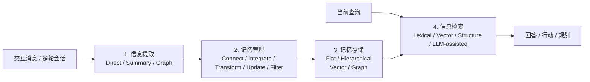

# Agent Memory 方案总结：10 种代表性 LLM 智能体记忆方法的统一拆解

基于论文 [Memory in the LLM Era: Modular Architectures and Strategies in a Unified Framework](https://arxiv.org/pdf/2604.01707) 与文中统一复现结果整理，面向个人学习使用。  
写法参考内部“产品实现逻辑解剖”风格：先看问题定位，再按系统层拆解，最后收束到关键取舍与结论。  
配套的完整学习知识库见 [study/README.md](/Users/yihaiwen/Documents/New%20project/memory_consolidation_small_pilot/study/README.md)，其中模块化展开讲义在 [study/agent_memory_modular_framework/README.md](/Users/yihaiwen/Documents/New%20project/memory_consolidation_small_pilot/study/agent_memory_modular_framework/README.md)。  
更新时间：2026-06-29

---

## 一、问题定位：Agent Memory 不是“外挂向量库”，而是长期上下文操作系统

传统 RAG 解决的是“外部知识怎么查回来”，而 Agent Memory 解决的是另一类问题：**交互过程中哪些信息该记、如何更新、存在哪一层、什么时候再取回来。**

所以，长期记忆系统的真正分水岭不在于“有没有 memory”，而在于它是否完整覆盖了下面四个环节：

1. **信息提取**：从交互消息里挑出值得进入记忆的内容。
2. **记忆管理**：把新信息和旧记忆做连接、整合、迁移、更新、过滤。
3. **记忆存储**：决定记忆是平铺存、分层存，还是树/图式存。
4. **信息检索**：当新问题到来时，决定用什么方式把相关记忆召回。

如果只做“写入向量库 + 相似度检索”，本质上只覆盖了第四步的一部分，离一个真正可持续的 Agent Memory 系统还差得很远。

---

## 二、统一分析框架：四大核心组件

这套统一框架的价值在于：它把“记忆方法”从一个模糊名词拆成了可比较的工程模块。后面看 10 种方法时，不再只问“谁分数高”，而是问：

- 它提取的是原始对话、摘要，还是实体关系图？
- 它有没有显式的关联、整合、迁移和过滤机制？
- 它的存储是单池、三层，还是树/图？
- 它检索时靠向量、图遍历，还是让 LLM 参与推理？

---

## 三、十种方法的系统地图

下面这张表先给一个总览。为了方便比较，我用的是“主导范式”写法；像 `MemTree`、`MemoryOS`、`MemOS` 这类方法其实都带有一定 hybrid 特征。

| 方法 | 信息提取 | 记忆管理主轴 | 记忆存储 | 信息检索 | 一句话理解 |
| --- | --- | --- | --- | --- | --- |
| `A-MEM` | 直接归档 + 摘要式 | 关联链接 + LLM 更新 | 平层向量存储 | 向量检索 | 把相关记忆显式“连起来” |
| `MemoryBank` | 直接归档 | 每日摘要整合 + 遗忘曲线 + 使用过滤 | 平层单池 | 相似度检索 | 像带时间强度分数的日记本 |
| `MemGPT` | 直接归档 | 层间迁移 + agent 自主更新 | 分层向量存储 | 词汇 + 向量 | 把记忆管理类比成 OS 分页 |
| `Mem0` | 直接归档 + 摘要式 | 相似记忆同步更新 + 内容去重 | 平层向量池 | 向量检索 | 信息保留相对完整，更新联动强 |
| `Mem0g` | 图式 | 结构边 + LLM 更新 + 内容过滤 | 图 + 向量 | 结构检索 | 把记忆显式化为实体关系图 |
| `MemoChat` | 直接归档 | 主题抽象整合 | 轻量平层摘要池 | LLM 辅助检索 | 省 token，但跨会话推理偏弱 |
| `Zep` | 直接归档 + 图式 | 结构边 + 社区形成 + LLM 冲突处理 | 分层图存储 | 词汇 + 向量 + 结构 | 强调关系结构和多跳检索 |
| `MemTree` | 直接归档 | 树内整合 + LLM Aggregate | 树状存储 | 向量检索 | 上层概念摘要、下层原始细节 |
| `MemoryOS` | 直接归档 | 关联 + 抽象/摘要 + 层级迁移 + 规则过滤 | 短/中/长三层向量存储 | 词汇 + 向量 | 性能、成本、稳定性的平衡型方法 |
| `MemOS` | 直接归档 + 摘要式 | 结构边 + 抽象整合 + agent 自主更新 | 树状分层 | 词汇 + 向量 | 强性能，但 token 成本高 |

### 3.1 我会把这 10 种方法分成四个流派看

1. **原始消息保留派**：`MemoryBank`、`MemGPT`  
   优点是信息完整，缺点是如果没有额外关联和整合，后期容易变成噪声堆积。

2. **摘要压缩派**：`A-MEM`、`Mem0`、`MemoChat`  
   优点是成本低、记忆更干净，缺点是摘要写坏了就会把错误长期固化。

3. **图结构派**：`Mem0g`、`Zep`  
   优点是多跳关系天然清晰，缺点是结构化提取容易损失原始语义细节。

4. **树/分层派**：`MemTree`、`MemoryOS`、`MemOS`  
   优点是能兼顾抽象概念和细粒度证据，也是论文里总体表现最强的一类。

---

## 四、信息提取层：先决定“写进去什么”

信息提取本质上是在做一个早期筛选器。筛选得太弱，后面都是噪声；筛选得太狠，后面会缺证据。

| 提取方式 | 具体做法 | 优点 | 风险 | 代表方法 |
| --- | --- | --- | --- | --- |
| **直接归档** | 原始消息 + 时间戳直接入库 | 信息最完整，不丢上下文 | 冗余大，后续检索噪声高 | `MemoryBank`、`MemGPT` |
| **摘要式提取** | 用 LLM 生成摘要、关键词、标签 | 压缩有效，便于长期维护 | 摘要会丢细节，也可能引入抽象偏差 | `A-MEM`、`Mem0`、`MemOS` |
| **图式提取** | 抽取实体、关系、时间，形成三元组/图 | 关系清晰，利于多跳 | 语义细腻度下降，容易丢原文语境 | `Mem0g`、`Zep` |

工程上很多方法其实不是单一范式，而是 **hybrid extraction**：

- `A-MEM`、`Mem0`、`MemOS` 同时保留了直接归档和摘要提取。
- `Zep` 同时保留了原始消息与图式抽取。
- `MemTree`、`MemoryOS` 的“摘要化”更多发生在后续管理阶段，而不是第一步提取阶段。

### 4.1 这一层的核心分歧

**分歧不在于“要不要压缩”，而在于“压缩后还能不能找回原始语义”。**

- `MemoryBank` 和 `MemGPT` 的优势，是**原始消息还在**，后面如果检索和拼接做得好，回答时仍能回到原证据。
- `A-MEM` 和 `Mem0` 的优势，是在保留直接归档底座的同时，把信息额外变成更高密度的记忆单元，降低长期维护成本。
- `Mem0g` 和 `Zep` 的问题，则是把语言压成图之后，结构更清楚，但**说话语气、限定条件、事件细节**这些东西更容易丢。

### 4.2 论文给出的关键判断

论文的一个很重要结论是：**信息完整性非常关键。**  
只保留图三元组的方法，往往不如还能保留原始对话片段的方法。一个直接例子是：在论文复现里，`Mem0` 在很多设置下都优于 `Mem0g`，作者明确把这解释为图式抽取带来的信息损失。来源见论文对 LOCOMO 结果的讨论：[arXiv PDF](https://arxiv.org/pdf/2604.01707)。

---

## 五、记忆管理层：真正决定方法差异的地方

如果说信息提取是在决定“写什么”，那记忆管理就是在决定“这些记忆以后会变成什么样”。论文把它拆成 5 个操作。

| 操作 | 要解决的问题 | 典型实现 | 代表方法 | 主要价值 |
| --- | --- | --- | --- | --- |
| **关联相关经验** | 让分散记忆彼此可达 | 关联链接 / 图结构边 | `A-MEM`、`Zep`、`Mem0g`、`MemoryOS` | 提升多跳推理能力 |
| **整合碎片化记忆** | 减少重复，形成更高层抽象 | 摘要 / 抽象 / 聚合 | `MemoryBank`、`MemoChat`、`MemTree` | 控制冗余，形成主题视图 |
| **跨层级转换** | 让短期信息进入长期结构 | FIFO 转移 / 社区形成 / 热度晋升 | `MemGPT`、`MemoryOS`、`Zep` | 解决上下文窗口装不下的问题 |
| **更新现有记忆** | 把新证据并入旧记忆 | 规则驱动 / LLM 驱动 / agent 驱动 | `MemoryBank`、`MemTree`、`MemGPT`、`MemOS` | 保持记忆新鲜、减少冲突 |
| **过滤无效信息** | 清掉过时、重复、低价值项 | 时间衰减 / 访问频率 / 相似度去重 | `MemoryBank`、`MemoryOS`、`Mem0` | 降低噪声，提高检索精度 |

### 5.1 三种更新范式

#### 1. 规则驱动

代表方法是 `MemoryBank` 和 `MemoryOS`。

- `MemoryBank` 用艾宾浩斯遗忘曲线给记忆强度打分。
- `MemoryOS` 用更系统的层级迁移、热度/频率等规则做管理。

优点是稳定、可控、好调试。缺点是规则边界比较硬，不够灵活。

#### 2. LLM 驱动

代表方法是 `MemTree`、`Zep`、`Mem0g`。

- `MemTree` 让 LLM 执行树内 Aggregate Operation。
- `Zep` 用 LLM 做图内冲突处理和语义约束更新。

优点是压缩能力强，表达力高。缺点是每次更新都可能引入新的抽象误差。

#### 3. Agent 驱动

代表方法是 `MemGPT`、`Mem0`、`MemOS`。

- 它们不只是在“合并两条文本”，而是让 agent 自己决定是 revise、merge、prune 还是 recall。

优点是自治性高，更像真实系统。缺点是 token 成本高，而且行为更难预测。

### 5.2 这一层最重要的经验

论文里最值得记住的一句其实是：**记忆关联能力，是多跳推理的核心。**

- 没有显式或隐式“连接”操作的方法，如 `MemoryBank`、`MemGPT`、`MemoChat`，在 LONGMEMEVAL 的多会话任务和 LOCOMO 的多跳任务上表现都偏弱。
- `Mem0` 虽然没有把“连接”做成显式图结构，但它会在写入时同步更新相似记忆，因此形成了一种**隐式关联**。这也是它显著强于 `MemoryBank` 的重要原因。

论文直接给出的一个量化观察是：在 LONGMEMEVAL 的 Multi-Session 任务上，`Mem0` 相比 `MemoryBank` 有明显提升。来源仍是统一框架论文的实验分析：[arXiv PDF](https://arxiv.org/pdf/2604.01707)。

---

## 六、记忆存储层：决定“记忆长什么样”

存储层可以从两个维度看：**组织方式** 和 **表示方式**。

### 6.1 组织方式：平层 vs 分层

| 组织方式 | 含义 | 代表方法 | 优点 | 风险 |
| --- | --- | --- | --- | --- |
| **平层存储** | 所有记忆在一个统一池里 | `MemoryBank`、`Mem0` | 实现简单、读写直接 | 规模大后噪声和冲突明显 |
| **分层存储** | 不同层承载不同粒度/职责 | `MemGPT`、`MemoryOS`、`MemOS`、`MemTree` | 便于长期维护和信息迁移 | 系统复杂度更高 |

### 6.2 表示方式：向量 vs 图

| 表示方式 | 含义 | 代表方法 | 优点 | 风险 |
| --- | --- | --- | --- | --- |
| **向量存储** | 文本嵌入后按语义相似度检索 | 绝大多数方法 | 通用、成熟、实现成本低 | 结构关系不显式 |
| **图存储** | 用树、知识图、时间图表示关系 | `MemTree`、`Zep`、`Mem0g`、`MemOS` | 多跳关系清晰，层次性强 | 维护和更新成本更高 |

### 6.3 为什么树/分层方法整体更强

这是论文最明确的总体结论之一：

- `MemTree`、`MemOS` 这类**树状结构**方法，在上层保留概念摘要、在叶子保留细节，因此能同时兼顾抽象和回溯。
- `MemoryOS` 这类**分层结构**方法，可以把短期、中期、长期记忆的管理策略拆开，避免所有信息都挤在一个池子里竞争。

换句话说，树/分层方法强，不是因为“结构更高级”，而是因为它们更像一个真正的缓存体系：

1. 高频、最近的信息留在近处。
2. 稳定、长期的信息上升到更抽象的层。
3. 需要追证据时，还能回到更细的节点或叶子。

---

## 七、信息检索层：最后决定“能不能把记忆叫回来”

| 检索范式 | 做法 | 适合场景 | 局限 | 代表方法 |
| --- | --- | --- | --- | --- |
| **词汇检索** | BM25、Jaccard 等表层匹配 | 专有名词、短语、实体精确命中 | 同义改写和语义失配明显 | 常作基础补充 |
| **向量检索** | 嵌入后做 top-k 相似度搜索 | 通用语义召回 | 结构关系不显式 | 大多数方法 |
| **结构检索** | 图遍历、树搜索、子图扩展 | 多跳推理、关系型问题 | 维护成本更高 | `Mem0g`、`Zep`、`MemTree`、`MemOS` |
| **LLM 辅助检索** | 让 LLM 改写 query、抽实体、引导搜索 | 模糊查询、复杂任务 | 成本更高，也更依赖模型质量 | `MemoChat`、`MemGPT` 等 |

### 7.1 这一层最容易被忽略的事实

很多方法看起来是在拼“检索器质量”，但论文的结果说明：**如果前面的信息提取和记忆管理做坏了，检索再强也只能在坏记忆里找答案。**

因此，信息检索更像是最后一道放大器：

- 好的记忆组织会让检索变简单。
- 差的记忆组织会把检索变成高成本补救。

这也是为什么 `MemoryOS` 在成本-性能权衡上表现更好：它不是单纯靠更多 tokens 强行搜，而是前面几层已经把信息分好类了。

---

## 八、评估基准：论文主要用什么测这些方法

### 8.1 LOCOMO

`LOCOMO` 面向**人类-人类长程对话**。

- 共 `10` 个长对话。
- 每个对话平均 `198.6` 个问题。
- 平均跨 `27.2` 个 session。
- 平均约 `588.2` 个对话轮次。
- 评估四种能力：`Single-Hop Retrieval`、`Multi-Hop Retrieval`、`Temporal Reasoning`、`Open-Domain Knowledge`。

### 8.2 LONGMEMEVAL

`LONGMEMEVAL` 面向**用户-AI 长期交互**。

- 共 `500` 个高质量问题。
- 每个样本平均 `50.2` 个 session。
- 平均历史长度约 `115,000` tokens。
- 评估四种长期记忆能力：`Information Extraction`、`Multi-Session Reasoning`、`Knowledge Updates`、`Temporal Reasoning`。

### 8.3 这些 benchmark 在奖励什么

| Benchmark | 更偏重什么 | 对方法的压力点 |
| --- | --- | --- |
| `LOCOMO` | 多跳、时间线、跨 session 证据拼接 | 关联能力和结构检索 |
| `LONGMEMEVAL` | 信息提取、知识更新、长期一致性 | 更新机制和上下文持久化 |

---

## 九、论文实验给出的关键结论

### 9.1 树状/分层存储总体占优

这是最核心的总论。

- 在 `LONGMEMEVAL` 上，`MemTree` 在 7B 设置下拿到 `36.92` 的 overall F1；72B 下最强现有方法是 `MemoryOS`，overall F1 为 `46.04`。
- 在 `LOCOMO` 上，`MemOS` 在 7B 和 72B 设置下分别拿到 `37.05` 和 `42.79` 的 overall F1。
- `MemoryOS` 虽然不是最极致的树结构，但在多个实验里体现出很强的综合平衡能力。

一个方便记忆的最小结果表：

| Benchmark | 7B 最强现有方法 | 72B 最强现有方法 |
| --- | --- | --- |
| `LONGMEMEVAL` overall F1 | `MemTree` `36.92` | `MemoryOS` `46.04` |
| `LOCOMO` overall F1 | `MemOS` `37.05` | `MemOS` `42.79` |

结论不是“图结构一定赢”，而是：**能把不同抽象层次的信息分开管理的方法更容易赢。**

### 9.2 保留原始信息非常重要

这是第二个必须记住的点。

- `Mem0` 往往优于 `Mem0g`。
- 论文明确把这解释成：**只保留图三元组，容易丢掉原始语言中的限定条件与语义细节。**

所以，图式提取不等于没价值，而是更适合做“关系增强层”，不适合彻底替代原始文本证据。

### 9.3 记忆关联能力决定多跳上限

论文指出，缺少显式或隐式记忆关联的系统，在多会话和多跳任务上会很吃亏。

- `MemoryBank`、`MemGPT`、`MemoChat` 都属于这一类短板比较明显的方法。
- `Mem0` 的亮点就在于：即便它没有像 `Zep` 那样显式建图，也能通过“相似记忆同步更新”形成隐式关联。

论文里有一个很直观的数字：在 `LONGMEMEVAL` 的 `Multi-Session` 任务上，`Mem0` 相比 `MemoryBank` 提升了 `18.60%` F1 和 `26.19%` BLEU-1。

### 9.4 时间推理强依赖 backbone LLM

时间推理是现有方法的共同弱项。

- 从 7B 扩到 72B 后，`MemoryOS` 和 `MemoChat` 在 LOCOMO 的时间类任务上都出现了明显跃迁。
- 论文据此认为：现有 memory 方法大多还没有真正内建“时间处理组件”，很多时间问题本质上仍在依赖 LLM 临场推理。

换句话说，今天很多系统并不是“会管理时间”，而只是“模型变大后更会猜时间”。

### 9.5 成本不是越高越好，但强方法普遍更贵

论文的 token 成本分析给出一个很现实的结论：

- `MemTree`、`MemOS` 性能高，但 token 开销也显著高。
- `MemoryOS` 在性能和成本之间更均衡。
- `MemoChat`、`MemoryBank` 虽然省 token，但性能明显不够。

因此，工程上真正值得学的不是“谁分最高”，而是**谁的单位 token 贡献更高**。

### 9.6 长期对话里存在明显的最近偏置

论文的 position sensitivity 分析表明：

- 大多数方法在证据出现在“后期 session”时效果更好。
- `A-MEM` 这种会动态修订记忆的方法，容易让更早证据被后续内容覆盖。
- `MemoryOS` 的早晚差距更小，论文明确给出的 `Late-Early gap` 只有 `+1.29` F1，因为它的层级迁移让历史信息保持相对独立，而不是反复被重写。

这说明长期记忆系统天然面临一个难题：**越会更新，越可能覆盖旧证据；越保守不更新，又越可能落后于新事实。**

---

## 十、关键实现难点与取舍

### 10.1 信息完整性 vs 结构化程度

把记忆压成三元组、标签或摘要，都会让检索更轻，但也都会损失语义。  
`Mem0` 优于 `Mem0g` 的现象，提醒我们：**结构化最好是增强层，不宜成为唯一表示。**

### 10.2 多跳能力 vs 维护成本

图和树确实更适合多跳，但维护代价更高。

- 树需要聚合更新。
- 图需要做去重、一致性维护、社区更新。

所以结构越强，系统工程复杂度通常也越高。

### 10.3 自主性 vs 可控性

`MemGPT`、`MemOS` 这类 agent-driven 方法更像真实系统，但也更像黑盒系统。  
规则驱动虽然笨一点，却更稳定、更容易排查。

### 10.4 时间稳定性 vs 最近偏置

长期对话里，最近信息天然更容易被召回。  
如果没有专门的时间组件，系统就会出现：

1. 旧事实被覆盖。
2. 临时信息被误当长期偏好。
3. 时间顺序在摘要更新里被洗平。

### 10.5 性能上限 vs token 成本

复杂 memory 系统很少是“免费”的。

- 更细的提取、更复杂的更新、更深的树/图维护，都会换来更多 token 消耗。
- 因此好的系统不是把每一步都做复杂，而是只把复杂度花在真正高价值的地方。

---

## 十一、两个具体例子：同一条记忆在不同方法里怎么流动

前面的分析偏“架构层”。如果要真正吃透这些方法，最好看一遍同一条信息在不同系统里的流转方式。

### 11.1 偏好更新例子：咖啡偏好应该怎么记

假设多轮对话如下：

- `S1`：用户说，“我乳糖不耐受，拿铁只喝燕麦奶。”
- `S5`：用户说，“最近可以少量喝牛奶了，但点咖啡还是优先燕麦奶。”
- `Q`：用户问，“以后帮我点拿铁时，你应该怎么选？”

同一段信息，在不同方法里的处理会很不一样：

| 方法 | 写入方式 | 更新方式 | 最终可能召回的内容 | 主要风险 |
| --- | --- | --- | --- | --- |
| `MemoryBank` | 直接保存 `S1`、`S5` 原文 | 靠时间和遗忘强度调节 | 可能同时召回两段原话 | 如果没有足够强的回答期推理，容易把“能少量喝牛奶”误当成“偏好已改变” |
| `Mem0` | 保存原文，同时生成偏好摘要 | 把“乳糖不耐受”和“拿铁优先燕麦奶”合并更新 | “拿铁默认燕麦奶；牛奶耐受度略提升，但不改变咖啡默认偏好” | 摘要如果写得太粗，可能遗漏“但”后面的限定关系 |
| `Mem0g` | 抽成三元组，如 `user -> prefers -> oat milk latte` | 更新图边和属性 | 可以较稳定地召回“偏好燕麦奶” | “少量喝牛奶”的语气和适用范围容易被压扁 |
| `MemoryOS` | 先保留原消息，再把稳定偏好转入长期层 | 短期层保留波动，中长期只保留稳定习惯 | 长期层是“拿铁优先燕麦奶”，短期层附带最新补充 | 规则设计不好时，可能把一次临时变化提早晋升成长期偏好 |
| `MemTree` | 叶子节点保留原话，上层节点保留“咖啡偏好摘要” | 通过聚合操作修订父节点摘要 | 根部摘要给出默认偏好，叶子还能回看例外条件 | 聚合摘要如果过度压缩，可能把“乳糖不耐受”和“口味偏好”混成一条 |

这个例子说明了一件事：**偏好类记忆并不是简单的事实记忆，而是“稳定默认值 + 局部例外 + 时间更新”的组合。**  
因此在真实系统里，偏好类项目特别适合：

1. 保留原始对话。
2. 额外存一个可更新的规范化摘要。
3. 把“长期默认偏好”和“最近临时变化”分层放置。

### 11.2 项目协作例子：deadline 更新和依赖关系怎么记

再看一个更工程化的例子：

- `S1`：用户说，“Atlas 项目 deadline 是 7 月 15 日，后端负责人是 Bob。”
- `S3`：用户说，“deadline 改到 7 月 22 日，上线前必须先完成安全评审。”
- `Q`：用户问，“Atlas 现在谁负责后端？最终 deadline 是多少？上线前还缺什么前置条件？”

这个例子同时考验三种能力：

1. **事实更新**：7 月 15 日要被 7 月 22 日覆盖。
2. **关系关联**：安全评审是上线前的依赖，不是普通备注。
3. **多点检索**：答案要同时拼出负责人、最终时间、前置条件。

不同方法的典型表现如下：

| 方法 | 容易答对什么 | 容易答错什么 | 原因 |
| --- | --- | --- | --- |
| `MemoryBank` | Bob 是后端负责人 | 可能把两个 deadline 都找回来，最后靠 LLM 临场判断 | 记忆保留完整，但更新关系不显式 |
| `MemGPT` | 能靠 agent 反复翻历史做补救 | 成本较高，行为不稳定 | 强依赖回答时的自主检索和工具调用 |
| `Mem0` | 最终 deadline + Bob + 依赖关系 | 如果摘要失真，可能把“安全评审”写成普通备注 | 隐式关联强，但仍依赖摘要质量 |
| `Zep` | “上线前依赖安全评审”这种关系题 | 对细语义和原文限定条件不够稳 | 图关系天然适合依赖建模 |
| `MemTree` / `MemOS` / `MemoryOS` | 三个子问题一起答对的概率更高 | 工程复杂、写入和维护成本更高 | 既能存更新后的摘要，又能回到叶子或低层节点查证据 |

这个例子更像真实业务系统里的问题，所以它也解释了为什么论文里树状/分层方法通常更强：  
**因为真实问题不是只问一条 fact，而是同时问“最新是什么、和谁有关、受什么约束”。**

---

## 十二、三类工程级项目蓝图

如果这份文档不只是为了记概念，而是为了以后真做项目，那还需要补一个视角：**这些方法分别适合什么产品形态。**

### 12.1 先给一个选型总表

| 项目目标 | 推荐起步方案 | 为什么 | 不建议一上来就做 |
| --- | --- | --- | --- |
| 个人助理 / 知识工作台 | `Mem0 + MemoryOS` 风格 hybrid | 既要记偏好，也要管时间和任务状态 | 纯图系统 |
| Coding Agent / Repo Copilot | `MemTree + raw fallback` | 要保留原始证据，又要有概念级摘要 | 只靠 summary-only |
| CRM / Support / Sales Agent | `Zep + Mem0` hybrid | 实体关系和长期客户画像都重要 | 纯原文堆积 |

### 12.2 项目一：个人知识工作台型 Agent

最接近的目标是 “WorkBuddy / executive assistant / personal ops agent” 这一路。

#### 适合的记忆设计

- **短期层**：当天任务、正在处理的文件、最近确认过的待办。
- **中期层**：当前项目状态、阶段目标、最近的关键决定。
- **长期层**：稳定偏好、长期习惯、常用模板、长期联系人和项目事实。

#### 推荐的工程组合

- **Memory 核心范式**：`MemoryOS` 的分层管理 + `Mem0` 的摘要更新。
- **主存储**：`Postgres` 或等价关系库，保存结构化事实和审计日志。
- **向量索引**：`Qdrant` / `FAISS`，保存会话摘要与文档片段嵌入。
- **对象存储**：原始文件、原始消息、生成结果。
- **任务调度**：定时 consolidation、daily digest、过期清理。

#### 为什么这类项目适合分层

因为它有三类完全不同的信息：

1. 瞬时上下文：今天在做什么。
2. 项目上下文：这个月项目推进到哪。
3. 长期个性化：用户偏好、习惯和稳定事实。

把这三类信息混在一个向量库里，后面几乎一定会出现上下文污染。

### 12.3 项目二：Coding Agent / Repo Copilot

这是最适合拿来练 memory system 的工程项目之一，因为代码任务天然有“原始证据”和“抽象总结”的双层需求。

#### 适合的记忆设计

- **叶子 / raw 层**：commit diff、报错日志、测试失败片段、关键代码引用。
- **摘要层**：模块职责、历史修复路径、已知坑、接口契约。
- **任务层**：当前 PR 的目标、 reviewer comment、未完成 action item。

#### 推荐的工程组合

- **Memory 核心范式**：`MemTree` 风格最合适。
- **原始证据存放**：git diff、日志片段、测试输出。
- **抽象记忆存放**：`state/*.md`、issue notes、decision log。
- **检索策略**：先向量或词汇召回模块摘要，再必要时跳回原始 diff / traceback。

#### 一个更完整的 MVP 形态

1. 每完成一轮任务，把“做了什么、改了什么、为什么这样改”写成一条 task memory。
2. 每个目录保留一个模块摘要，按需定期聚合。
3. 回答复杂问题时，先检索摘要，再回原始代码证据校验。

这种架构最大的价值是：**既能记住“这个 repo 大概怎么工作”，又不至于把过去的抽象理解当成不可质疑的真相。**

### 12.4 项目三：CRM / Support / Sales Agent

这类系统特别适合拿来做“实体关系 + 长期画像”的混合记忆。

#### 适合的记忆设计

- **账户层**：公司、部门、购买历史、合同状态。
- **联系人层**：角色、偏好、最近互动、风险信号。
- **事件层**：工单、会议纪要、销售机会、投诉和升级事件。

#### 推荐的工程组合

- **Memory 核心范式**：`Zep` 风格图关系 + `Mem0` 风格摘要同步。
- **结构化主库**：`Postgres` 保存 account/contact/ticket 主实体。
- **图层**：保存 “谁属于谁”、“哪个工单关联哪个产品”、“哪个机会依赖哪个审批”。
- **向量层**：保存客服对话摘要、会议纪要、邮件摘要。

#### 为什么图在这里更值钱

因为这类系统最常见的问题不是“客户说过什么”，而是：

1. 这个联系人属于哪个账户。
2. 这个账户最近关联了哪些风险事件。
3. 这个工单和哪次会议、哪个产品缺陷有关。

这类问题天然适合关系检索，而不只是语义相似度检索。

---

## 十三、真正值得研究的完整仓库：哪些不是小 demo

上面那三类项目蓝图，解决的是“应该怎么设计”。  
如果你现在更关心的是“我到底该去看哪些完整仓库”，那必须把论文方法和真实开源工程分开看，因为**不是每个方法都有工业级完整仓库**。

下面这份清单是我在 **2026-06-29** 做的一次公开仓库筛选，标准很简单：

1. 代码量和目录结构要足够完整，不是单脚本 demo。
2. 至少要覆盖库、服务、集成、测试、部署中的多个层次。
3. 最好已经有持续 release、文档、SDK、server 或 playground。

### 13.1 Tier A：真正值得 clone 下来研究的完整项目

| 项目 | 最接近的方法谱系 | 公开仓库规模 | 为什么它算“完整项目” | 先看哪些目录 |
| --- | --- | --- | --- | --- |
| [Letta](https://github.com/letta-ai/letta) | `MemGPT` 路线 | `23.6k` stars, `7,466` commits | 不是论文 toy repo，而是完整 stateful agent 平台，带 agents API、CLI、数据库迁移、sandbox、tests、docker 和 release | `letta/`、`db/`、`alembic/`、`sandbox/`、`tests/` |
| [Mem0](https://github.com/mem0ai/mem0) | `Mem0` 路线 | `59.6k` stars, `2,407` commits | 包含库、self-hosted server、cloud 对接、CLI、集成、评测、tests、agent plugins，已经是“产品化 memory layer” | `mem0/`、`server/`、`openmemory/`、`integrations/`、`evaluation/`、`tests/` |
| [Graphiti](https://github.com/getzep/graphiti) | `Zep` / `Mem0g` 路线 | `28.1k` stars, `880` commits | 完整 temporal graph memory engine，带 graph core、server、MCP server、tests、spec、多种图后端支持 | `graphiti_core/`、`server/`、`mcp_server/`、`tests/`、`spec/` |
| [MemoryOS](https://github.com/BAI-LAB/MemoryOS) | `MemoryOS` 路线 | `1.5k` stars, `270` commits | 虽然没 Letta/Mem0 那么成熟，但已经不是 demo，带 PyPI 包、MCP、playground、eval、Docker、docs | `memoryos-pypi/`、`memoryos-mcp/`、`memoryos-playground/`、`eval/` |

这四个里面，如果你要的是“几千行代码、完整工程、能真正学架构”的仓库，我建议优先顺序是：

1. **`Mem0`**：最像“生产可用 memory layer”。
2. **`Letta`**：最像“带长期记忆的 agent runtime / platform”。
3. **`Graphiti`**：最像“真正的图记忆引擎”。
4. **`MemoryOS`**：最像“论文方法向可用框架演化”的开源实现。

### 13.2 Tier A-：很有价值，但要注意它们不是产品核心仓库

| 项目 | 应该怎么理解 | 规模 | 价值 | 限制 |
| --- | --- | --- | --- | --- |
| [Zep](https://github.com/getzep/zep) | 这是 **Zep Cloud 的 examples / integrations 仓库**，不是 Zep 产品核心本体 | `4.7k` stars, `362` commits | 很适合看 benchmark、framework integration、eval harness、ontology 和 MCP 接法 | 它本身不是完整托管服务源码；真正的图内核是 `Graphiti` |

这一点很重要。`Zep` 这个 repo 名字很容易让人误以为“这就是完整产品源码”，但它的 README 明确说了：**这不是 Zep 的产品或服务本体，而是 example/integration/tooling 仓库**。  
所以如果你想研究：

- **图记忆内核怎么做**：看 `Graphiti`
- **Zep 怎么接 LangGraph / AutoGen / ADK / benchmark**：看 `Zep`

### 13.3 Tier B：完整研究仓库，但还达不到工业级完整平台

| 项目 | 最接近的方法 | 规模 | 适合学什么 | 不适合学什么 |
| --- | --- | --- | --- | --- |
| [A-MEM](https://github.com/agiresearch/A-mem) | `A-MEM` | `1.1k` stars, `31` commits | 学 agentic linking、Zettelkasten 风格 note evolution、A-MEM 核心机制 | 不适合拿来学完整平台工程 |
| [MemoChat](https://github.com/LuJunru/MemoChat) | `MemoChat` | `29` stars, `37` commits | 学 memo 训练流程、数据和模型 pipeline | 不适合当 production memory infrastructure 样板 |

这两类仓库我会建议你这么看：

- 如果你在研究**方法机制**，它们有价值。
- 如果你在研究**工业级系统怎么搭**，它们不够。

### 13.4 目前没有看到“成熟完整公开仓库”的方法

按我这次检索结果，下面几类方法目前**没有看到和 Letta / Mem0 / Graphiti 同级别的成熟公开仓库**：

| 方法 | 当前公开状态 | 更接近的替代研究对象 |
| --- | --- | --- |
| `MemoryBank` | 论文很经典，但这次没有找到清晰、持续维护的完整公开仓库 | `Mem0`、`MemoryOS` |
| `MemTree` | 论文清楚，但没找到成熟公开 full repo | `MemoryOS`、`Graphiti`、`Letta` |
| `MemOS` | 论文有，但这次没有定位到成熟 OSS 仓库 | `MemoryOS`、`Mem0` |
| `Mem0g` | 没有看到独立、成熟、广泛使用的 standalone 工程 repo | `Graphiti` |

这不是说这些方法没价值，而是说：

- **论文方法 != 一定有可研究的完整工程仓库**
- **想学工程实现时，应该优先看“方法精神最接近、但工程最完整”的替代仓库**

### 13.5 如果你真要研究“完整工业工程”，推荐这样读仓库

#### 路线 1：想看 Memory 作为独立产品层怎么做

优先看 [Mem0](https://github.com/mem0ai/mem0)：

1. `mem0/`：核心 memory API 和算法入口。
2. `server/`：self-hosted 服务怎么部署和鉴权。
3. `openmemory/`：更完整的产品形态。
4. `integrations/`：怎么接外部框架。
5. `evaluation/` 和 `tests/`：怎么评估和回归测试。

#### 路线 2：想看 Memory 怎么嵌进 agent runtime

优先看 [Letta](https://github.com/letta-ai/letta)：

1. `letta/`：主运行时。
2. `db/` + `alembic/`：状态持久化、schema、迁移。
3. `sandbox/`：工具执行和隔离环境。
4. `tests/`：系统级回归。
5. `compose.yaml`：本地完整栈启动方式。

#### 路线 3：想看图记忆和时间知识图怎么做

优先看 [Graphiti](https://github.com/getzep/graphiti)：

1. `graphiti_core/`：图构建和 temporal fact 管理核心。
2. `server/`：服务接口层。
3. `mcp_server/`：怎么把图记忆能力暴露给 agent 客户端。
4. `tests/`：图检索、ingestion、时间有效性测试。
5. `spec/`：接口和行为约束。

#### 路线 4：想看论文方法怎样逐步变成可用框架

优先看 [MemoryOS](https://github.com/BAI-LAB/MemoryOS)：

1. `memoryos-pypi/`：核心包实现。
2. `memoryos-mcp/`：如何以 MCP server 暴露能力。
3. `eval/`：怎么复现实验。
4. `memoryos-playground/`：面向交互体验的外层。

### 13.6 一个现实判断：你不该指望“一份 repo 学完所有 memory”

工业级 memory 系统通常分成三种不同层面：

1. **memory algorithm layer**：写入、更新、检索怎么做。
2. **agent runtime layer**：状态、工具、消息、任务流怎么组织。
3. **product infra layer**：数据库、鉴权、部署、日志、评测、集成怎么落地。

所以真正好的学习路径，不是死盯一个仓库，而是组合着看：

- `Mem0` 学产品化 memory layer
- `Letta` 学 stateful agent runtime
- `Graphiti` 学图结构和时间事实
- `MemoryOS` 学论文方法到框架化演进

---

## 十四、如果自己做，一个更稳的实现路线

不建议一上来就做全量 `MemOS` 或全量图系统。更稳的路线通常是三步走：

### 14.1 Phase 1：先做 `Mem0` 风格的可用 MVP

目标不是“最先进”，而是先把最核心闭环跑通：

1. 原始消息保留。
2. 关键事实/偏好摘要化。
3. 写入时做基本去重和相似记忆更新。
4. 检索时先摘要、再 raw fallback。

这一步最适合验证：

- memory write 值不值得做；
- 哪些信息真的值得持久化；
- 摘要错误最常出现在哪类场景。

### 14.2 Phase 2：补成 `MemoryOS` 风格的分层系统

当你发现“所有记忆都在一个池里开始互相污染”时，就该进入第二步：

- 把当天会话记忆和稳定长期事实拆层。
- 引入衰减、热度、迁移策略。
- 开始做定时 consolidation，而不是每轮都重写所有记忆。

这一步最大的收益是：系统会从“能记住”变成“能长期稳定使用”。

### 14.3 Phase 3：再决定要不要加图或树

只有当你真的遇到以下需求，再考虑图/树：

1. 多跳依赖问题非常多。
2. 用户经常问“谁和谁有关”、“为什么会这样”、“还缺什么前置条件”。
3. 你已经确认平层 + 分层摘要不足以支撑复杂检索。

这时：

- 如果更偏层次抽象和 raw fallback，优先走 `MemTree`。
- 如果更偏实体关系和依赖图谱，优先走 `Zep` / `Mem0g`。
- 如果两边都要，可以做 hybrid，但不要在 MVP 阶段上来就全做。

---

## 十五、个人学习视角下的结论

把这 10 种方法放在一起看，我觉得最值得记住的不是具体实现细节，而是下面四句：

1. **Agent Memory 的关键不只是存，而是更新与关联。**
2. **只做摘要会丢证据，只做原文堆积会丢可用性。**
3. **树状/分层结构之所以强，是因为它同时保住了抽象与细节。**
4. **时间推理仍是现有方法的短板，很多“强表现”背后其实是在吃 backbone LLM 的推理红利。**

如果以后自己做一个 memory agent，我会优先遵循下面这个原则：

> **短期保留原始消息，中期做分段摘要，长期只存稳定事实；检索时优先走结构化摘要，但始终保留回到原始证据的能力。**

这基本就是当前这批方法里最稳妥、也最工程化的一条共识路线。

---

## 十六、参考

- 统一框架论文：  
  [Memory in the LLM Era: Modular Architectures and Strategies in a Unified Framework](https://arxiv.org/pdf/2604.01707)
- 本文档只整理论文中复现对比的 10 种代表性方法：  
  `A-MEM`、`MemoryBank`、`MemGPT`、`Mem0`、`Mem0g`、`MemoChat`、`Zep`、`MemTree`、`MemoryOS`、`MemOS`
- 公开完整仓库参考：  
  [Letta](https://github.com/letta-ai/letta)、[Mem0](https://github.com/mem0ai/mem0)、[Graphiti](https://github.com/getzep/graphiti)、[Zep](https://github.com/getzep/zep)、[MemoryOS](https://github.com/BAI-LAB/MemoryOS)、[A-MEM](https://github.com/agiresearch/A-mem)、[MemoChat](https://github.com/LuJunru/MemoChat)
- 说明：  
  为了便于比较，文中的“提取/存储/检索”使用的是主导范式归类；部分方法本身是 hybrid 设计，因此这里做了适度抽象。
